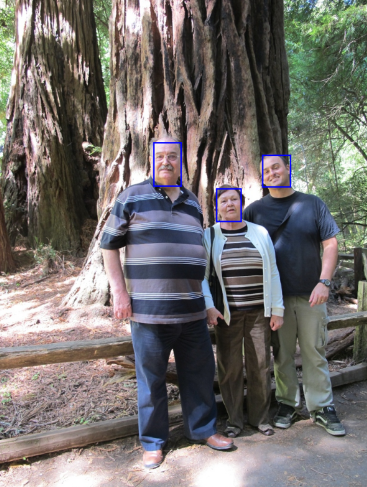
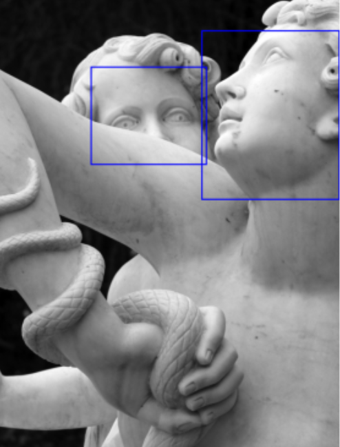
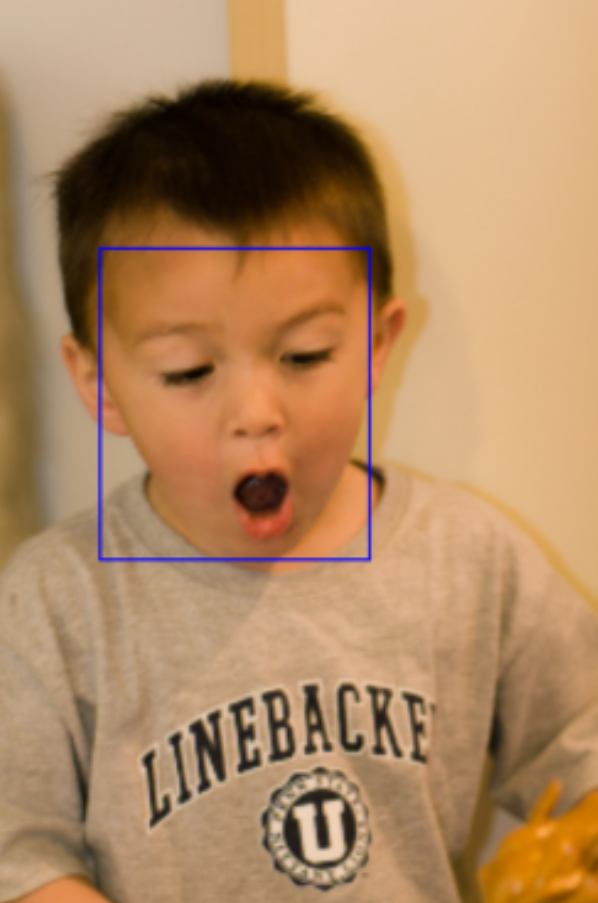
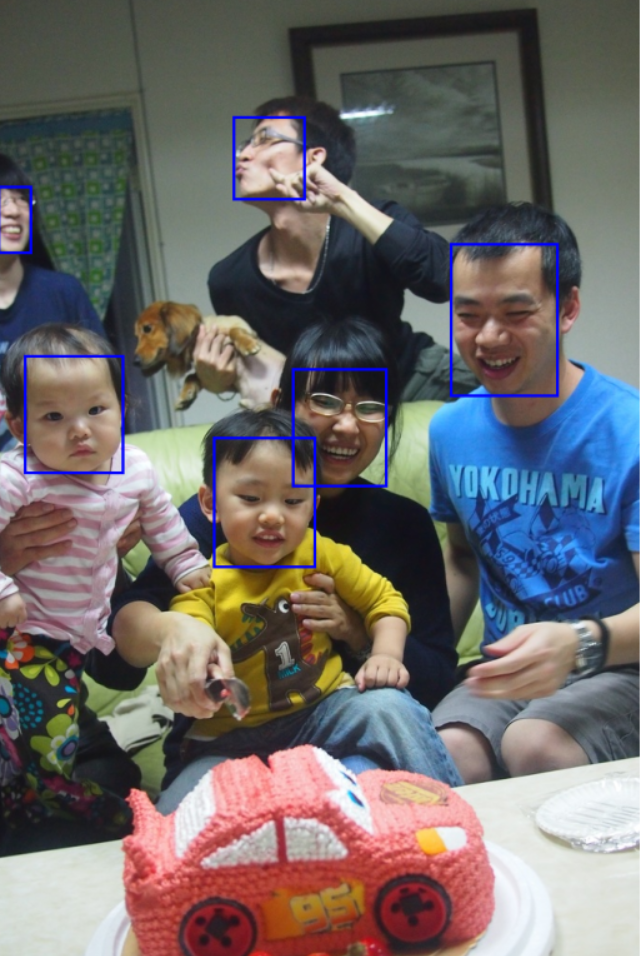

# PyTorch-Detector

**PyTorch-Detector** is a neural network detector built on top of the SSD300 architecture using PyTorch. It is trained specifically for face detection tasks.

## 🔥 Quick Start

Launch the notebook directly in Google Colab:

[](https://colab.research.google.com/github/danilkos00/PyTorch-Detector/blob/main/detection.ipynb)

```bash
!git clone https://github.com/danilkos00/PyTorch-Detector.git
%cd PyTorch-Detector
!pip install -r requirements.txt
```

## Dependencies

- `torch`
- `torchvision`
- `torchmetrics`
- `albumentations`

Install all required packages via:

```bash
pip install -r requirements.txt
```

## 📁 Dataset

The project uses a face detection dataset from Kaggle:  
[Face Detection Dataset](https://www.kaggle.com/datasets/fareselmenshawii/face-detection-dataset)

When initializing the `FacesDataset` from `dataset/faces.py`, the face detection dataset is downloaded automatically.

## Results

- **mAP@0.5**: **60%**
- Visual examples below demonstrate real detections:






## Pretrained Weights

You can download the pretrained model for face detection from the following link:

**[Download Pretrained Weights](https://drive.google.com/uc?id=1TTPEvt2OpJ6hm0uBnTrv2f0xo1960PNL)**  


## Project Structure

```
PyTorch-Detector/
├── dataset/
│   └── faces.py
├── src/
│   └── model.py
│   └── loss.py
├── tools/
│   └── detection_utils.py
│   └── train.py
├── train_and_infer.ipynb
├── requirements.txt
└── README.md
```
